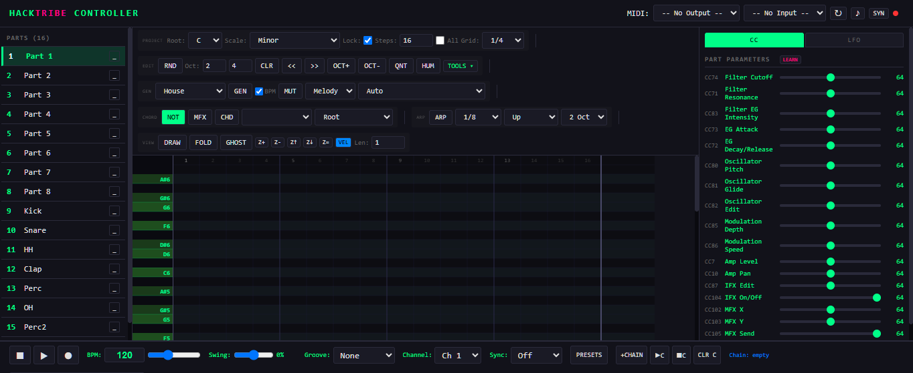
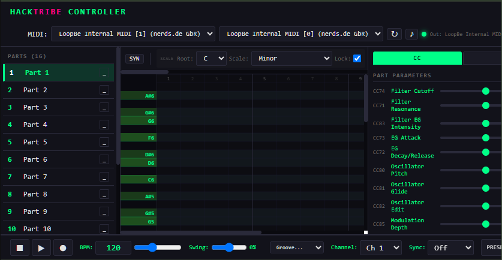

# HackTribe Controller

Controlador web completo para el **Korg Electribe E2/E2s con firmware HackTribe**.

Secuenciador de notas y drums con piano roll interactivo, generador de patrones por estilo musical, arpegiador, groove humanize, y control MIDI total del hardware.

---

## Live Demo

**[gallegherplus.github.io/hacktribe-controller](https://gallegherplus.github.io/hacktribe-controller/index.html)**

---

## Features

### Sequencer
- Piano roll interactivo con 16 partes (canales MIDI 1-16)
- Draw, erase, fold (semitono), ghost notes, velocity lane
- Zoom horizontal/vertical, scroll, auto-scroll al reproducir
- Scale lock con 12 modos (Mayor, Menor, Dorian, Phrygian, etc.)
- Pattern Chain para encadenar hasta 16 patrones
- Undo/Redo con historial completo

### Generator
- 23 estilos musicales: House, Techno, Drum & Bass, Trap, Eurodance, Hip Hop, Trip-Hop, Industrial, Acid, Lo-Fi, Loops, y más
- 4 modos: Melody / Rhythm / Both / Chords
- Generación inteligente por escala y rango de octava
- Groove humanize: swing, shuffle, accent, randomize
- Snap to Scale: cuantizar notas a la escala seleccionada

### Arpeggiator
- Arpegiador con 16 patrones (Up, Down, UpDown, Random, Chord, etc.)
- Rate configurable: 1/1 a 1/32, con tripletas y dotted
- Octave range: 1-4 octavas
- Sync con el tempo del hardware

### MIDI
- Conexión Web MIDI API al Electribe
- Clock sync: Start/Stop/Continue
- Send notes, CC, program change
- MFX toggle por parte
- Export MIDI file (.mid)

### Synth Preview
- Web Audio API synth integrado
- Oscillators: sine, square, sawtooth, triangle
- Filter: lowpass/highpass/bandpass
- Envelope: attack/decay/sustain/release
- Reverb y delay

---

## Versions

| Version | Description | Link |
|---------|-------------|------|
| Desktop | Full features: piano roll, draw, fold, ghost notes, velocity lane, zoom | [DESKTOP.html](https://gallegherplus.github.io/hacktribe-controller/DESKTOP.html) |
| Mobile | Optimized for tablets/phones: touch gestures, auto-scroll, fullscreen | [MOBILE.html](https://gallegherplus.github.io/hacktribe-controller/MOBILE.html) |
| Manual | Complete documentation with screenshots and guides | [MANUAL.pdf](https://gallegherplus.github.io/hacktribe-controller/MANUAL.html) |

---

## Getting Started

### Mobile (Recommended)
1. Open **[MOBILE.html](https://gallegherplus.github.io/hacktribe-controller/MOBILE.html)** on your phone/tablet
2. Tap **SYN** to enable audio preview
3. Connect to your Electribe via Web MIDI (Chrome/Edge)
4. Select MIDI output and start creating

### Desktop
1. Download **[DESKTOP.html](https://gallegherplus.github.io/hacktribe-controller/DESKTOP.html)**
2. Open in Chrome/Edge with Web MIDI support
3. Connect your Electribe
4. Full feature set available offline

### Connected Mode (with hardware)
1. Connect Electribe via USB
2. Open the app in Chrome/Edge
3. Grant MIDI access
4. Notes, clock, and CC are sent in real-time

### Sync Mode (without hardware)
1. Create projects in the app
2. Export as MIDI file
3. Transfer to Electribe via SD card or MIDI bulk dump

---

## Keyboard Shortcuts

| Key | Action |
|-----|--------|
| `Space` | Play / Stop |
| `R` | Randomize notes |
| `G` | Generate pattern |
| `M` | Mutate pattern |
| `C` | Clear all notes |
| `H` | Shift notes left |
| `L` | Shift notes right |
| `U` | Octave up |
| `D` | Octave down |
| `S` | Snap to scale |
| `A` | Toggle arpeggiator |
| `Z` | Undo |
| `Y` | Redo |

---

## Tech Stack

- **HTML/CSS/JS** — single file, no dependencies
- **Web MIDI API** — hardware connection
- **Web Audio API** — synth preview
- **CSS Custom Properties** — dark theme with Clockless design tokens
- **Responsive** — mobile-first with landscape/portrait breakpoints

---

## Screenshots

| Desktop | Mobile |
|---------|--------|
|  |  |

---

## License

MIT

---

## Author

Created by [gallegherplus](https://github.com/gallegherplus)
